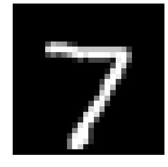
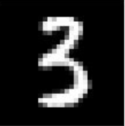
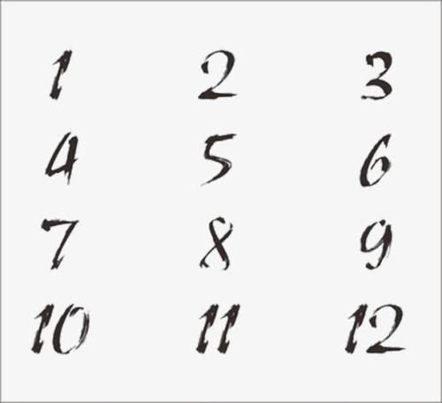

#### 搭建模型

```python
import tensorflow as tf
from tensorflow import keras

# get data
(train_images, train_labels), (test_images, test_labels) = keras.datasets.mnist.load_data()

# setup model
model = keras.Sequential([
    keras.layers.Flatten(input_shape=(28,28)),
    keras.layers.Dense(128, activation=tf.nn.relu),
    keras.layers.Dense(10, activation=tf.nn.softmax)
])

# 编译
model.compile(optimizer=tf.train.AdamOptimizer(), 
    loss='sparse_categorical_crossentropy',
    metrics=['accuracy'])

# train model
model.fit(train_images, train_labels, epochs=5)

# evaluate
test_loss, test_acc = model.evaluate(test_images, test_labels)

print('test accuracy:', test_acc)
```

**模型构建方法二：**

```python
# 加载MNIST数据集 -- 《深度学习》第二章案例
from keras.datasets import mnist
(train_images, train_labels), (test_images, test_labels) = mnist.load_data()
train_images.shape # (60000, 28, 28)
train_labels.shape # (60000,)

# 将训练数据和标签关联在一起
from keras import models, layers

net = models.Sequential()
net.add(layers.Dense(512, activation='relu', input_shape=(28*28,))) # 直接输入展平的张量
net.add(layers.Dense(10,activation='softmax')) # 最后输出10个结果

# 编译网络
net.compile(optimizer='rmsprop',
           loss='categorical_crossentropy',
           metrics=['accuracy'])

# 训练数据准备
train_images = train_images.reshape((60000, 28 * 28))
train_images = train_images.astype('float32') / 255 # 数据归一化

test_images = test_images.reshape((10000, 28 * 28))
test_images = test_images.astype('float32') / 255 # 数据归一化

# 对标签进行分类编码：变成one-hot编码
from keras.utils import to_categorical

train_labels_final = to_categorical(train_labels)
test_labels_final = to_categorical(test_labels)

train_images.shape # (60000, 784)
train_labels[0] # 5,这是非onehot编码的标签

train_labels_final.shape # (60000, 10)

# 拟合网络：训练开始
history = net.fit(train_images, train_labels_final, epochs=5, batch_size=128)

'''
Epoch 1/5
60000/60000 [==============================] - 5s 78us/step - loss: 0.0288 - acc: 0.9916
Epoch 2/5
60000/60000 [==============================] - 5s 80us/step - loss: 0.0221 - acc: 0.9932
Epoch 3/5
60000/60000 [==============================] - 5s 78us/step - loss: 0.0171 - acc: 0.9950
Epoch 4/5
60000/60000 [==============================] - 5s 79us/step - loss: 0.0133 - acc: 0.9961
Epoch 5/5
60000/60000 [==============================] - 5s 80us/step - loss: 0.0100 - acc: 0.9970
'''

# 保存模型
import os
model_name = "keras_mnist_trained_model.h5"
save_dir = os.path.join(os.getcwd(), 'saved_models')

if not os.path.isdir(save_dir):
  os.makedirs(save_dir)
  
model_path = os.path.join(save_dir, model_name)
net.save(model_path)
print("模型保存在：%s" % model_path)

# 评估模型
test_loss, test_acc = net.evaluate(test_images, test_labels_final)
print('test_loss: ', test_loss) # test_loss:  0.06558757138366236，交叉熵损失函数，分类用
print('test_acc: ', test_acc) # test_acc:  0.9831

# 使用模型进行测试数据集预测
# test_images.shape # (10000, 784)
test_images[0].shape # (784,)
to_be_predicted = test_images[0].reshape((1,784)) # .reshape([1,784])
res = net.predict(to_be_predicted) # array([[2.7967730e-13, 4.2122917e-16, 6.3757026e-09, 1.7213833e-07,
        # 6.7121612e-19, 6.7293619e-12, 3.6417281e-21, 9.9999988e-01,
       #  7.6961736e-12, 5.2838995e-09]], dtype=float32)
res.argmax() # 下标从0开始，这个结果是7
```

注意单个图片加载进来预测，一定要扩展一个维度，因为训练时也预留了位置，给批量输入。

**画图看看**

```python
# 显示图片
import matplotlib.pyplot as plt
# plt.imshow(test_images[0].reshape((28,28,1)))

im = test_images[0].reshape(28, 28)
fig = plt.figure()
plotwindow = fig.add_subplot(111)
plt.axis('off')
plt.imshow(im, cmap='gray')
plt.show()
# plt.savefig("test.png")  # 保存成文件
plt.close()
```





#### 加载模型以预测

上面我们在`saved_models`中保存了`keras_mnist_trained_model.h5`，现在我们加载这个模型，并看看模型的`summary`.

```python
# 加载模型进行预测
from keras.models import load_model
model = load_model('./saved_models/keras_mnist_trained_model.h5')

model.summary()
'''
_________________________________________________________________
Layer (type)                 Output Shape              Param #   
=================================================================
dense_3 (Dense)              (None, 512)               401920    
_________________________________________________________________
dense_4 (Dense)              (None, 10)                5130      
=================================================================
Total params: 407,050
Trainable params: 407,050
Non-trainable params: 0
_________________________________________________________________
'''
```

模型加载完毕，现在开始处理。


```python
from PIL import Image
from keras.preprocessing.image import img_to_array

# 整合为一个cell
def load_image_to_array(path):
  image = Image.open(path)
  image = image.resize((28, 28)) # resize(28,28)是错的 
  image = img_to_array(image) # 此时是4个通道，加载进来的是png图像
  image = image[:,:,0]
  image = image.reshape([1,28*28]) # reshape到网络可以接收
  return image

def softmax_to_label(res):
  return res.argmax()
  
image_to_predict = load_image_to_array('./9.png')
res = model.predict(image_to_predict)

label = softmax_to_label(res)

print("The number is: ", label)
```




这种通过模型输出的很准，测试下来都是准确预测。




这种我随便在网上找的，然后拆分预测，结果都是2，取了其中的一个通道。

这也可以看出模型并非完全智能，模型学到的是像素的分布。

总之，本篇的目的是通过最简单的MNIST数据集来打通使用Keras做训练、预测的Pipeline。

END.